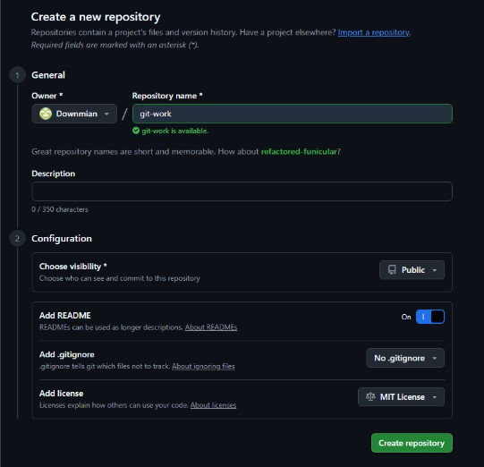
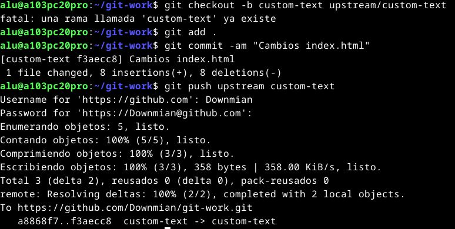
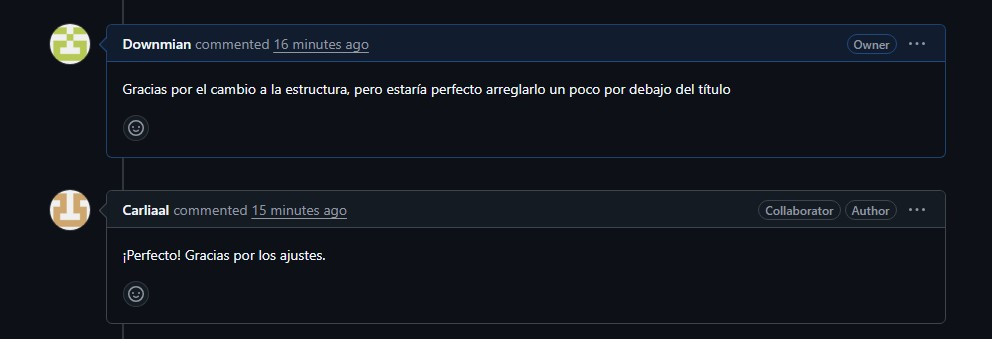
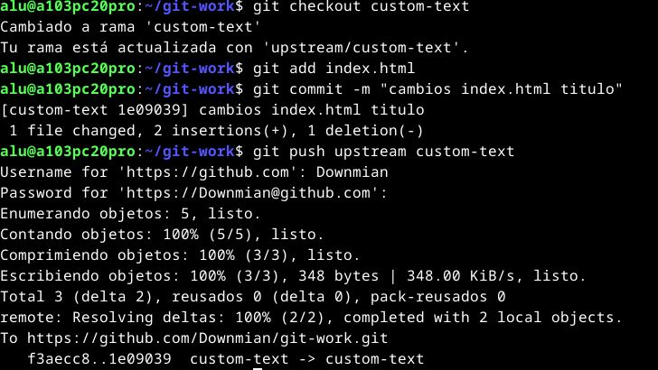

# TÍTULO DE LA PRÁCTICA

**_Nombre:_** Damián Maneiro Lorenzo, Carla García Pacheco  
**_Curso:_** 2º de Ciclo Superior de Desarrollo de Aplicaciones Web.

### ÍNDICE

- [Introducción](#id1)
- [Objetivos](#id2)
- [Material empleado](#id3)
- [Desarrollo](#id4)
- [Conclusiones](#id5)

#### **_Introducción_**. 

La siguiente práctica propuesta consta de una serie de pasos destinados a practicar y reforzar el uso del control de versiones con Git. Consiste en un total de 21 mini-tareas, en las que crearemos un repositorio en GitHub y llevaremos a cabo diversas actividades, como pull requests, issues, commits, entre otras.

#### **_Objetivos_**. 

El objetivo de esta práctica, como se mencionó en el apartado anterior, es reforzar los conocimientos adquiridos en el curso anterior sobre el manejo de Git y GitHub. Para ello, las distintas mini-tareas abordarán el uso de ramas y los comandos básicos necesarios para hacer un buen uso de esta herramienta.

#### **_Material empleado_**. 

Enumeramos el material empleado tanto hardware como software y las conficuraciones que hacemos (configuraciones de red por ejemplo)

#### **_Desarrollo_**. 

1. **El alumnado trabajará por parejas: user1 y user2. Indicar quién es user1 y quién es user2.**

   - user1: Damián
   - user2: Carla

1. **user1 creará un repositorio público llamado git-work en su cuenta de GitHub, añadiendo un README.md y una licencia MIT.**

   Creamos el repositorio en GitHub añadiendo lo que se nos indica.

   

1. **user1 clonará el repo y añadirá los ficheros: index.html, bootstrap.min.css y cover.css. Luego subirá los cambios al upstream.**

   Clonamos en repositorio en nuestra máquina.

   

   Creamos los ficheros index.html, bootstrap.min.css y cover.css.

   

   Añadimos los cambios que hemos hecho y los subimos al upstream.

   

1. **user2 creará un fork de git-work desde su cuenta de GitHub.**

   - Para crear un fork, se utiliza la herramienta que ofrece el propio GitHub. Esto generará una copia del repositorio original creado por el usuario 'user1'.

   

   - Después de hacer clic en 'Create fork', deberíamos tener un repositorio similar al siguiente.

   

1. **user2 clonará su fork del repo.**

   - Para clonar el repositorio ya creado mediente unn fork, pondremos el siguiente comando en una terminal:

   

1. **user1 creará una issue con el título "Add custom text for startup contents".**

   Vamos al apartado de "Issues" en GitHub y la creamos

   

1. **user2 creará una nueva rama custom-text y modificará el fichero index.html personalizándolo para una supuesta startup**

   - Para crear la nueva rama, crearemos una rama en local con el comando, git branch "nombre de la rama", nos moveremos a ella, git checkout "nombre de la rama". Una vez realizados los cambios en el index.html, realizaremos un commit y pondremos el siguiente comando para que se cree la rama en el repositiorio y a su vez realizar el PR.

   

1. **user2 enviará un PR a user1.**

   - Cuando realizamos el comando del apartado anterior, deberíamos tener un mensaje como este en el repositorio de github. Este indica que hay una PR de la rama creada anteriormente

   

1. **user1 probará el PR de user2 en su máquina (copia local) creando previamente un remoto denominado upstream, y realizará ciertos cambios en su copia local que luego deberá subir al propio PR.**

   - Añadimos en repositorio local si es que no existe en nuestra máquina

   

   - Cambiamos a la rama donde se encuentra el PR, realizamos modificaciones y subimos los cambios a la rama del PR

   

1. **user1 y user2 tendrán una pequeña conversación en la página del PR, donde cada usuario incluirá, al menos, un cambio más.**

   - Se hace la conversación en el apartado de "Pull requests" en GitHub y cada uno sube un aporte

   
   

1. **user1 finalmente aprobará el PR, cerrará la issue creada (usando una referencia a la misma) y actualizará la rama principal en su copia local.**

   - Cerramos el PR aprobándolo de la manera que se ve en la siguiente imagen y actualizamos la rama principal con la copia de nuestra local

   
   

1. **user2 deberá incorporar los cambios de la rama principal de upstream en su propia rama principal.**

   - Para incorporar los cambios se ejecutará el siguiente comando:

   

1. **user1 creará una issue con el título "Improve UX with cool colors".**
1. **user1 cambiará la línea 10 de cover.css a: color: purple;**
1. **user1 hará simplemente un commit local en main → NO HACER git push.**
1. **user2 creará una nueva rama cool-colors y cambiará la línea 10 de cover.css a: color: darkgreen;**
1. **user2 enviará un PR a user1.**
1. **user1 probará el PR de user2 (en su copia local). A continuación tratará de mergear el contenido de la rama cool-colors en su rama principal y tendrá que gestionar el conflicto: Dejar el contenido que viene de user2.**
1. **Después del commit para arreglar el conflicto, user1 modificará la línea 11 de cover.css a: text-shadow: 2px 2px 8px lightgreen;**
1. **user1 hará un commit especificando en el mensaje de commit el cambio hecho (sombra) y que se cierra la issue creada (usar referencia a la issue). A continuación subirá los cambios a origin/main.**
1. **user1 etiquetará esta versión (en su copia local) como 0.1.0 y después de subir los cambios creará una "release" en GitHub apuntando a esta etiqueta.**

> **_IMPORTANTE:_** si estamos capturando una terminal no hace falta capturar todo el escritorio y es importante que se vea el nombre de usuario.

Si encontramos dificultades a la hora de realizar algún paso debemos explicar esas dificultades, que pasos hemos seguido para resolverla y los resultados obtenidos.

#### **_Conclusiones_**. 

En esta parte debemos exponer las conclusiones que sacamos del desarrollo de la prácica.
